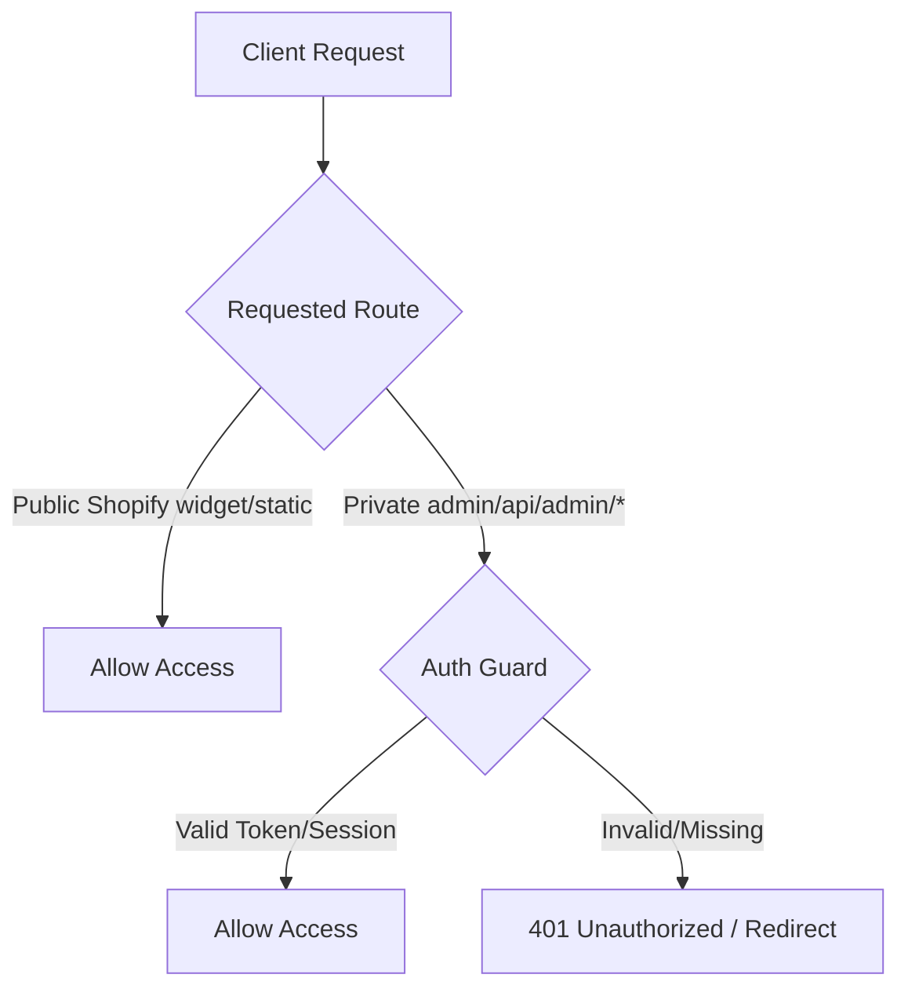

# HCHAHAL Support Console - Admin Dashboard Security Plan

This document details the security model and protection paths required to secure the admin dashboard console (`/admin-dashboard.html`) before deploying the FastAPI backend live on the public internet.

---

## 1. Why the Admin Dashboard Must Be Protected

Currently, the admin dashboard (`/admin-dashboard.html`) and its associated files (`widget.js`, `widget.css`) are served statically. When the backend URL is deployed publicly (e.g., `https://hchahal-console.up.railway.app`), anyone visiting the `/admin-dashboard.html` path will be able to:
*   View all active customer support conversations.
*   Draft, edit, and trigger suggested replies.
*   Access customer order details from Shopify and the Selling Partner API (SP-API) sandbox.
*   Interact with Supabase support tables directly.

To prevent unauthorized access, data leaks, and malicious ticket manipulation, access to the admin dashboard and private API routes must be gated.

---

## 2. Protection Architecture

---

## 3. Public vs. Private Resource Scoping

To allow the public Shopify storefront chat widget to communicate with the backend while keeping the management portal secure, we partition our endpoints as follows:

### Public Routes (No Auth Required)
These endpoints must remain open so that storefront chat widgets can render and exchange messages for end-users:
*   `GET /` & `GET /index.html` (widget iframe/simulation index page)
*   `GET /widget.js` & `GET /widget.css` (storefront widget assets)
*   `POST /api/chat` (storefront widget send-message endpoint)
*   `GET /api/agent-replies/{session_id}` (storefront widget message-polling endpoint)
*   `GET /health` (uptime checking and load-balancer probes)

### Private Routes (Auth Mandated)
These resources must be blocked behind an authentication guard:
*   **Static Assets**: `/admin-dashboard.html` (the support agent portal HTML layout)
*   **Conversations API**: `GET /api/conversations` (fetching lists of chats)
*   **Replies API**: `POST /api/agent-replies` (posting support responses)
*   **Draft Assistant API**: `POST /api/amazon/draft/analyse` (generation of response suggestions)
*   **Notes API**: `GET /api/notes/{session_id}` & `POST /api/notes` (support agent logs)
*   **Orders API**: `GET /api/amazon/orders/{order_id}` (retrieved order records)
*   **Knowledge API**: `GET /api/knowledge/*` (internal lookup and edit routers)

---

## 4. Implementation Options

### Option A: The MVP Gate (Simple Token/Password)
*   **Mechanism**: A simple query-parameter or header token checked via a FastAPI Dependency or middleware.
*   **Config**: Defined via the `ADMIN_DASHBOARD_TOKEN` environment variable.
*   **Workflow**:
    1.  The support agent logs in by visiting `/admin-dashboard.html?token=YOUR_SECURE_TOKEN`.
    2.  The token is saved to `localStorage` or `sessionStorage` in the browser.
    3.  All subsequent admin API requests attach this token in the `Authorization: Bearer <TOKEN>` header.
    4.  FastAPI rejects all non-matching token requests with `401 Unauthorized`.

### Option B: The Production Standard (Supabase Auth / Google Workspace)
*   **Mechanism**: Integrating Supabase Auth or Google OAuth 2.0.
*   **Workflow**:
    1.  A login page redirects the user to sign in using their corporate Google Workspace email account (`*@hchahal.com`).
    2.  The backend verifies the OAuth JWT token.
    3.  Allows authorization based on role claims.

---

## 5. Live Deployment Safeguard

> [!IMPORTANT]
> **Deployment Guardrail Rule**: Never deploy the code to a public HTTPS staging or production URL without having either Option A or Option B active. Leaving `/admin-dashboard.html` open to public routing is an automated audit failure.
