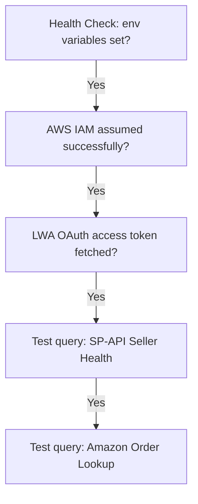

# Amazon SP-API Connector Integration Plan

This plan details the credentials, setup flow, and validation logic required to establish a secure, human-in-the-loop Amazon Selling Partner API (SP-API) connection.

---

## 1. Amazon Developer Credentials Checklist

Before doing real API testing or querying live Amazon customer data, you must register as a developer and configure resources in AWS and Amazon Seller Central:

### Step 1: Register as an Amazon SP-API Developer
1. Go to the [Amazon Seller Central Developer Console](https://sellercentral.amazon.com/developer/register).
2. Request a **Developer Profile** for your account. You will need to explain your application's data usage policies (particularly regarding Personally Identifiable Information / PII if handling shipping addresses).

### Step 2: Configure AWS Identity and Access Management (IAM)
Amazon SP-API uses AWS Signature Version 4 for request signing.
1. **Create an IAM User**: Create a programmatically active IAM user in the AWS Console. Save the `AWS_ACCESS_KEY` and `AWS_SECRET_KEY`.
2. **Create an IAM Policy**: Create a policy permitting `execute-api:Invoke` on SP-API endpoints.
3. **Create an IAM Role**: Create an IAM role designed for SP-API. Define a **Trust Relationship** allowing the IAM User to assume the role. Save the `Role ARN`.

### Step 3: Register an SP-API Application
1. Log in to Seller Central and go to **Apps** ➔ **Develop Apps**.
2. Click **Register new application**.
3. Link the app to the `Role ARN` created in Step 2.
4. Once created, save the **LWA Client ID** and **LWA Client Secret** (Login with Amazon credentials).

### Step 4: Authorize the App & Get Refresh Token
1. Generate an authorization link inside the Developer Console.
2. Authorize the application using your Seller Central account.
3. Save the returned **LWA Refresh Token** (which provides persistent API access).

---

## 2. Environment Variables Configuration

The following parameters must be configured inside `backend/.env` for local testing:

| Environment Variable | Source | Description |
| :--- | :--- | :--- |
| `AMAZON_LWA_CLIENT_ID` | Seller Central App | LWA Application ID |
| `AMAZON_LWA_CLIENT_SECRET` | Seller Central App | LWA Client Secret |
| `AMAZON_LWA_REFRESH_TOKEN` | Seller Consent | Refresh token authorizing Seller Central access |
| `AMAZON_AWS_ACCESS_KEY` | AWS IAM User | AWS programmatic access key |
| `AMAZON_AWS_SECRET_KEY` | AWS IAM User | AWS secret key |
| `AMAZON_ROLE_ARN` | AWS IAM Role | ARN of the role to assume for SP-API signing |
| `AMAZON_REGION` | AWS / SP-API | SP-API region endpoint (`us-east-1`, `eu-west-1`, etc.) |
| `AMAZON_MARKETPLACE_ID` | Amazon | Specific Marketplace ID (e.g. `ATVPDKIKX0DER` for US) |

---

## 3. Integration Testing Stages

1. **Stage 1 (Current)**: Environment validation and health check endpoint `/api/amazon/health`.
2. **Stage 2**: AWS IAM connection test & LWA token exchange.
3. **Stage 3**: Fetching mock Seller Central status endpoints.
4. **Stage 4**: Real order details lookup for agents inside the details panel.
