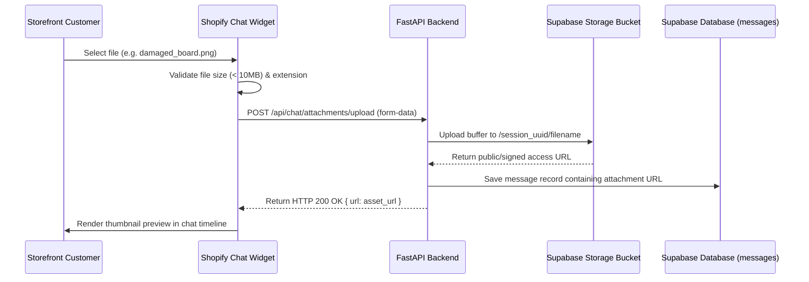

# Attachment Upload Architecture Plan

This document plans the implementation of storefront image, video, and file uploads to allow customers to submit visual proof of defects, incorrect items, or damaged shipments.

---

## 1. Supported Attachment Use-Cases

The storefront chat widget will support uploading the following asset types:
-   **Damaged Item Evidence**: Photos showing cosmetic flaws, physical breaks, or transit damage to justify shipping claims.
-   **Battery & Charger Photos**: Clear images of the charging adapter label and battery ports to confirm original manufacturer equipment is in use before diagnosing safety escalations.
-   **Return Verification**: Images confirming packaging state and item completeness to clear returns authorization.
-   **Videos**: Up to 15-second clips demonstrating device error beep codes, indicator warnings, or failure to power on.

---

## 2. Storage Provider: Supabase Storage

**Supabase Storage** is the primary choice for storing user-submitted media due to:
-   Native PostgreSQL permissions and row-level security (RLS) integration.
-   Direct token authentication compatibility with current database connections.
-   Built-in CDN caching and media resizing helpers.

### Storage Bucket Setup
1.  Create a private storage bucket named `customer_attachments` in the Supabase Dashboard.
2.  Set up bucket access policies restricting public list rights, but allowing write-only access for anonymous/authenticated widget clients.

---

## 3. Data Flow Diagram



---

## 4. Frontend Widget Changes (Future Implementation)

To support this plan in the Shopify widget, we will:
1.  **Add File Input Element**:
    ```html
    <label for="hbs-file-input" class="hbs-attachment-btn" title="Add attachments">
      <svg viewBox="0 0 24 24" width="20" height="20" fill="none" stroke="currentColor">
        <path stroke-linecap="round" stroke-linejoin="round" stroke-width="2" d="M15.172 7l-6.586 6.586a2 2 0 102.828 2.828l6.414-6.586a4 4 0 00-5.656-5.656l-6.415 6.585a6 6 0 108.486 8.486L20.5 13" />
      </svg>
      <input type="file" id="hbs-file-input" accept="image/*,video/*,application/pdf" style="display: none;" />
    </label>
    ```
2.  **Display Attachment Indicator**:
    Add a progress bar and thumbnails inside the chat composer box when a upload is in progress.
3.  **Enforce Limits**:
    -   Max file size: **10MB** (checked client-side before stream submission).
    -   Allowed types: `image/jpeg`, `image/png`, `video/mp4`, `application/pdf`.

---

## 5. Security & Ingestion Safeguards
-   **Signed URLs**: Attachment directories containing customer proof will use UUID folders with restricted permissions. Support console staff will retrieve items using short-lived signed URLs (`GET /storage/v1/object/sign/...`) generated dynamically on load to prevent link scraping.
-   **Content Scanning**: Integrations with basic image validation checks will block execution of executable binary payloads disguised with double file extensions (e.g. `evidence.png.exe`).
