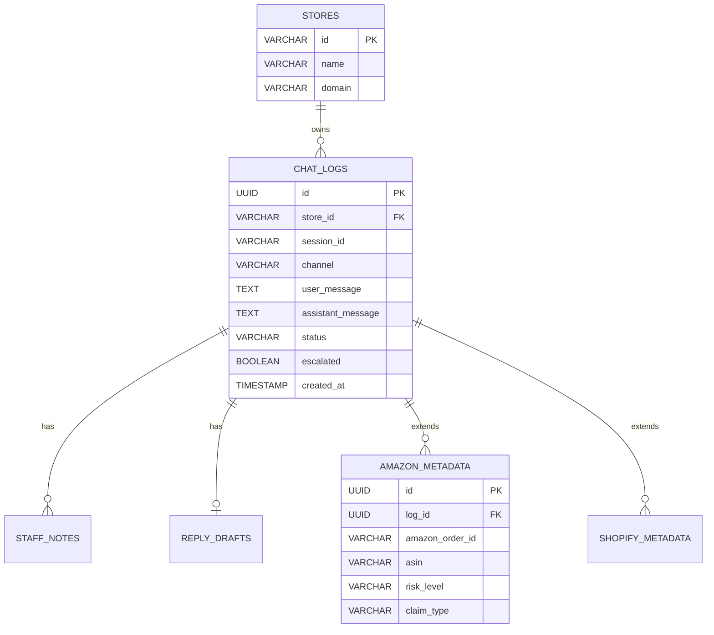

# Multi-Channel Architecture Plan: HCHAHAL Support Console

This document outlines the architectural blueprint for scaling the **HCHAHAL Support Console** into a unified, multi-store, multi-channel support automation prototype.

---

## 1. Overview & Goal

The core objective is to build **one central console** that acts as the single source of truth for support agents, supporting multiple distinct stores and multiple incoming communication channels.

### Stores (Orchestration Scope)
* `hoverboard_store` (Hoverboard Store UK)
* `aroma_haven` (Aroma Haven Botanicals)
* `hcs_gadgets` (HCS Gadgets)

### Communication Channels
1. `shopify_widget` (Storefront chat client)
2. `amazon` (Amazon SP-API)
3. `future_email` (IMAP/SMTP/SendGrid)
4. `future_ebay` (eBay Messaging API)
5. `future_tiktok` (TikTok Shop API)

---

## 2. Channel Integration Blueprint

### Channel 1: Shopify Chat Widget
* **Role**: Acts as the real-time customer-facing storefront helper.
* **Mechanism**: Shoppers send queries from the web client. Responses are generated via local keyword guides (fallback to human escalation).
* **Connection**: The client polls the backend at `/api/agent-replies/{session_id}` to retrieve agent responses.
* **Database Mapping**: Ingests directly into `chat_logs` with the `store_id` specified and `channel` value defaulting to `'shopify_widget'`.

### Channel 2: Amazon SP-API Connector
* **Role**: Feeds customer emails, order inquiries, cancellation requests, and refund claims into the central console.
* **Mechanism**: A background poller retrieves new messages via Amazon's Seller Partner API (SP-API), which are then parsed and categorized.
* **Connection**: Messages do **not** trigger auto-responses. Instead, they write to the central schema as new tickets requiring manual agent triage.
* **Database Mapping**: Ingests into `chat_logs` with the `store_id` mapped by Seller ID/ASIN configurations, and the `channel` value set to `'amazon'`.

---

## 3. Database Schema Strategy

To scale efficiently, we separate shared transactional schemas from channel-specific metadata.

### Shared Tables (Used by all channels)
* **`stores`**: Maps identifiers (e.g. `'hoverboard_store'`) to domain branding.
* **`chat_logs`** / **`conversations`**: Unified log containing `session_id`, `store_id`, `user_message`, `assistant_message`, `status`, and `escalated` flags.
* **`staff_notes`**: Shared notes feed for internal agent comments.
* **`reply_drafts`**: Universal workspace for unsent message drafts.

### Channel-Specific Tables
* **`amazon_metadata`**: Extends conversations with Amazon-specific tags: Amazon Order ID, ASIN, Risk Level (e.g., *High*, *Medium*, *Low*), and Claim Type (*A-to-Z Claim*, *Negative Feedback*, etc.).
* **`shopify_metadata`**: Stores Shopify checkout IDs and cart tokens.
* **`email_metadata`**: Tracks email headers, SMTP message IDs, and attachment references.

---

## 4. Column Additions & Dashboard Badges

### Storing Store & Channel Mappings
We add a `channel` column to the unified log container:
* **Table**: `chat_logs`
* **Column**: `channel` (`VARCHAR(50) NOT NULL DEFAULT 'shopify_widget'`)
* **Constraints**: Checked to match allowed values: `CHECK (channel IN ('shopify_widget', 'amazon', 'email', 'ebay', 'tiktok'))`.

### Dashboard Console Visualizations
The support dashboard console displays a channel badge next to each thread preview in the sidebar list:
* **Shopify Badge**: Green badge with widget icon `[💬 Shopify]`.
* **Amazon Badge**: Orange badge with package icon `[📦 Amazon]`.
* **Dashboard Filters**: Status tabs can filter conversations by store AND by channel (`Filter by Channel: All | Shopify Widget | Amazon`).

---

## 5. Implementation Guardrails

### Safe Parallel Development
* **Mock Payload Parsing**: We can build and test message parsing rules for Amazon payload templates offline.
* **Dashboard Badges**: We can update dashboard CSS and template structures to display multi-channel icons using placeholders.
* **Order Lookup Routers**: We can structure Shopify and Amazon order lookup modules side-by-side as distinct helper files.

### Critical Constraints (What not to mix yet)
* **Zero Auto-Replies to Amazon**: Automated chatbot triggers must be locked to `shopify_widget` only. Amazon queries must always be placed directly into the human review queue.
* **Separation of APIs**: Keep Shopify Admin client requests and Amazon SP-API client requests in independent adapter modules. Do not mix credentials or auth libraries.
