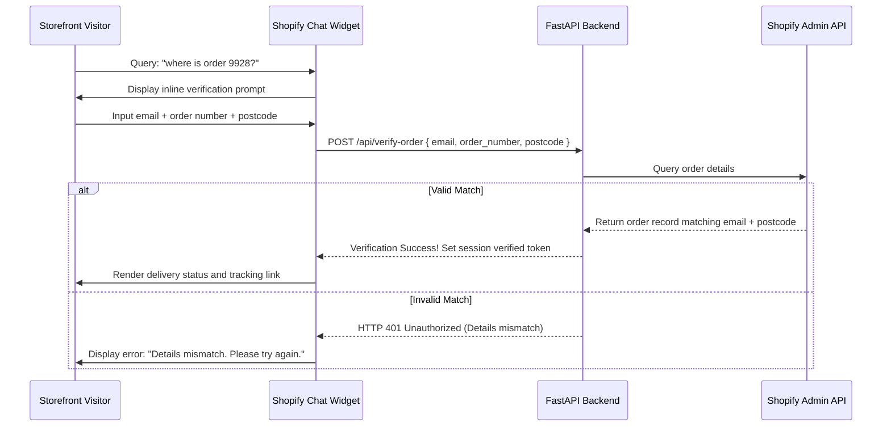

# Customer Identity Verification & Authentication Plan

This document details the security and lookup strategy for verifying visitor identities on the Shopify storefront before retrieving private checkout records or shipping tracking status.

---

## 1. Multi-Tiered Access Control

To protect customer privacy while maintaining low-friction interactions, we establish two access tiers:

| Tier | Context | Rights / Scope | Verification Trigger |
| :--- | :--- | :--- | :--- |
| **Tier 1: Guest** | General visitors | May search general support FAQs (e.g. shipping times, returns policies, product specs). | None |
| **Tier 2: Verified** | Order queries | May check order delivery details, tracking numbers, addresses, item contents, or request refunds. | Triggered automatically when order-related keywords are queried (e.g., "where is my order", "check status", "cancel order"). |

---

## 2. MVP Order Verification Flow

For immediate deployment, we will implement a lightweight, OTP-free verification form inside the widget:



### Verification UI Inside Storefront Widget
- The widget intercepts message submissions matching verification-only intents.
- Instead of showing a normal chat text input, the widget displays three form fields:
  1. **Customer Email Address**
  2. **Order Number** (e.g. #1024)
  3. **Shipping Postcode**
- Submitting the form requests backend verification. If verified, the input composer reverts to a standard text area, and the chat continues in authenticated mode.

---

## 3. Future Shopify Customer Portal Integration

To achieve seamless Single Sign-On (SSO) for logged-in buyers:
1.  **Detect Logged-In Customer Status**:
    Retrieve the customer's secure access token from Shopify's liquid global context:
    ```javascript
    const customerId = "{{ customer.id }}";
    const customerEmail = "{{ customer.email }}";
    const customerToken = "{{ customer.multipass_identifier }}";
    ```
2.  **Pass Auth Headers**:
    If a user is logged into their Shopify storefront account, the chat widget automatically appends an authorization token header to the backend `/api/chat` requests:
    `Authorization: Bearer <shopify-customer-token>`
3.  **Automatic Ingestion**:
    The backend validates the Customer Access Token via Shopify's Graph Storefront API. Once verified, the visitor bypasses manually entering order/email details.

---

## 4. Console Dashboard Context View

Once a session is verified, the admin dashboard updates the right-side **Session Metadata** sheet to render context details:

-   **Verified Customer Card**:
    -   Name: `Jane Doe` (Verified Shopify Customer Account)
    -   Email: `jane.doe@example.com`
    -   Customer since: `2025-01-12`
-   **Associated Order Summary**:
    -   Order ID: `#4920` (Created 2 days ago)
    -   Total Paid: `£149.99`
    -   Fulfillment status: `Shipped`
    -   Tracking: `DHL: 1Z999AA10123456784`
-   **Internal Actions Bar**:
    -   `[View Customer in Shopify Admin]` (Link pointing to `https://admin.shopify.com/store/your-store/customers/id`)
    -   `[Resend Order Confirmation Email]`
