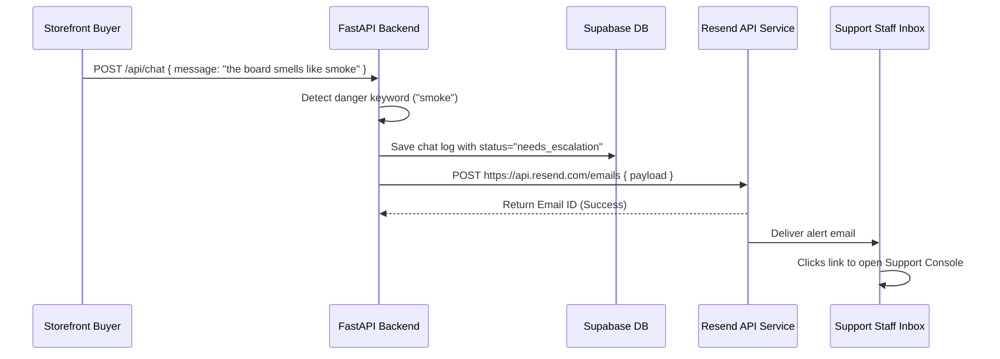

# Email Notification & Safety Escalation Plan

This document details the configuration and architecture for sending email alerts to support managers when a high-risk safety warning is triggered or when a customer explicitly requests human takeover.

---

## 1. Trigger Policy: When to Dispatch Alerts

To prevent email fatigue and ensure critical cases are resolved promptly, email dispatches are strictly restricted:

-   **Trigger Event**:
    1.  The session status is updated to `needs_escalation` (either via bot auto-classification of danger keywords or customer human-intent keywords).
    2.  An active buyer session is flagged as high-risk (e.g. fire hazard, battery overheating, swelling).
-   **No-Dispatch Event**:
    -   Standard bot keyword matches (FAQ lookups, shipping time queries, returns instructions).
    -   Subsequent customer messages sent inside an already escalated session.

---

## 2. Recommended Email Service Provider: Resend

We recommend using **Resend** to dispatch transactional emails:
-   Modern developer-first API interface with clean pricing models.
-   First-class support for single-turn HTML styling and React-email layouts.
-   Simple SDK integrations with python libraries.
-   No SMTP configuration required.

---

## 3. Escalation Data Flow



---

## 4. Proposed Alert Email Template (HTML)

The alert dispatched to support managers will follow this structured layout:

```html
<!DOCTYPE html>
<html>
<head>
  <style>
    body { font-family: -apple-system, sans-serif; color: #111; line-height: 1.6; }
    .container { max-width: 500px; margin: 20px auto; padding: 20px; border: 1px solid #e5e7eb; border-radius: 8px; }
    .alert-header { background-color: #ef4444; color: white; padding: 10px 15px; border-radius: 4px; font-weight: bold; }
    .details { background-color: #f9fafb; padding: 15px; border-radius: 4px; margin: 15px 0; border: 1px solid #f3f4f6; }
    .btn-link { display: inline-block; background-color: #0066cc; color: white; padding: 10px 18px; text-decoration: none; border-radius: 4px; font-weight: bold; }
  </style>
</head>
<body>
  <div class="container">
    <div class="alert-header">⚠️ Safety Escalation Triggered</div>
    <p>A customer chat session has been auto-escalated to human review due to danger keywords or human takeover request.</p>
    
    <div class="details">
      <strong>Store:</strong> Hoverboard Store UK<br/>
      <strong>Session ID:</strong> <code>test-takeover-ca838f3a-d416-4616</code><br/>
      <strong>Trigger Message:</strong> "the battery charger gets extremely hot and smells like burning"<br/>
      <strong>Time:</strong> 2026-07-01 20:18:19 UTC
    </div>
    
    <a href="https://commerce-support-console-production.up.railway.app/admin-dashboard.html?token=ADMIN_DASHBOARD_TOKEN" class="btn-link">Open Support Console Thread</a>
  </div>
</body>
</html>
```

---

## 5. Security & Ingestion Safeguards
-   **Token Masking**: The email dispatch service will never send the raw `ADMIN_DASHBOARD_TOKEN` string inside links unless sent to verified staff aliases.
-   **Alert Rate-Limiting**: To prevent spam in the event of customer query looping, the backend will verify if an escalation email has already been dispatched for this `session_id` within the last 15 minutes before sending another request.
