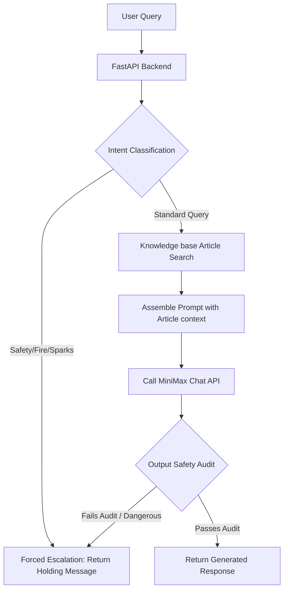

# MiniMax Support Brain Integration Plan

This document plans the integration of the MiniMax Large Language Model (LLM) into the HCHAHAL Support Console query processing pipeline. It explains how MiniMax will generate helpful, safe support responses while remaining restricted by active safety guardrails.

---

## 1. Role of MiniMax support Brain

-   **Conversational Inquiries**: MiniMax will process natural language questions that cannot be addressed by exact keyword matching (e.g. *"I bought this board 2 months ago and it won't charge, what does that mean?"*).
-   **Context-Aware Drafts**: Use knowledge articles retrieved by the `KnowledgeService` as system prompt inputs to construct correct answers without hallucinating policy terms.

---

## 2. Configuration & Environment Setup

Two new environment variables will be added to the FastAPI backend `.env` and Railway configurations:

-   `MINIMAX_API_KEY`: Secret API credential to authorize calls to MiniMax inference endpoints.
-   `MINIMAX_MODEL`: Configured LLM model variant (e.g. `abab6.5-chat`).

### Code Integration Blueprint (app/config.py)
```python
class Settings(BaseSettings):
    # ... other config settings ...
    MINIMAX_API_KEY: Optional[str] = None
    MINIMAX_MODEL: str = "abab6.5-chat"
```

---

## 3. Strict Safety Instruction Layers

The system prompt provided to MiniMax will strictly enforce core support rules. If MiniMax generates output violating these constraints, the middleware will intercept and discard the answer.

### System Instructions Payload Example
```text
You are the AI Assistant for Hoverboard Store UK.
You must strictly obey the following safety constraints:
1. Always direct customers to use the original charger or a manufacturer-approved replacement charger.
2. In case of charging troubleshooting, warn the customer to only leave it plugged in for 20 minutes if there are no signs of overheating, burning smell, smoke, sparks, swelling, or physical damage.
3. If the user reports battery heat, smoke, sparks, swelling, or burning smell, IMMEDIATELY declare a safety hazard and stop diagnosing.
4. You must never promise refunds, discounts, or ship replacements without manager approval.
```

---

## 4. High-Risk Auto-Escalation Pipeline

To keep human review required for critical topics:



### Safety Audit Layer
If the customer's query contains words like `spark`, `burning`, `swelling`, `smoke`, `fire`, or `melt`, or if the MiniMax output itself triggers these keywords, the backend bypasses normal completion rendering, updates the table status to `needs_escalation` immediately, and returns the human holding template instead.
