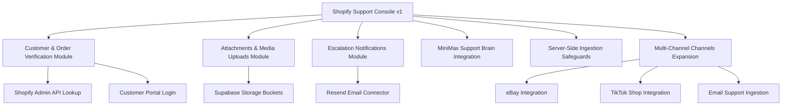

# HCHAHAL Support Console: Product & Support Platform Roadmap

This document outlines the phased roadmap for the next development milestones of the HCHAHAL Support Console ecosystem. It details the upcoming technical modules scheduled to expand support automation, storage capabilities, security, and multi-channel coverage.

---

## Technical Module Overview

---

## 1. Customer & Order Verification Module
*   **Objective**: Secure and verify user identities to protect sensitive customer records, track shipping milestones, and retrieve order data directly.
*   **Key Components**:
    *   **Shopify Admin API Integration**: Connect backend to fetch real-time orders, line items, fulfillments, and tracking links by querying customer email, postcode, and order numbers.
    *   **Shopify Customer Accounts Login**: Integrate Shopify Storefront API Customer Account tokens (`multipass` or native OAuth flow) to auto-verify logged-in customers.
    *   **Dashboard Display**: Populate confirmed order statuses, carrier details, tracking milestones, and item profiles in the sidebar sheet for active conversations.

---

## 2. Attachments & Media Uploads Module
*   **Objective**: Enable customers to provide visual evidence of product issues directly from the storefront widget interface.
*   **Key Components**:
    *   **Storefront File Picker**: Add a file picker widget element supporting image (`.jpg`, `.png`), video (`.mp4`), and PDF formats.
    *   **Supabase Storage Buckets**: Implement secure upload endpoints targeting a private/public bucket with UUID-scoped folders.
    *   **Dashboard Console Media Cards**: Render thumbnail links and preview overlays in the console's chat history view so support staff can review proof of damage or incorrect charger items.

---

## 3. Escalation Notifications Module
*   **Objective**: Instantly alert support staff when high-risk customer issues require immediate manual review.
*   **Key Components**:
    *   **Trigger Classification**: Flag conversations when critical keywords are detected (e.g. fire, battery smoke, swelling, A-to-Z claims) or when a human agent is explicitly requested.
    *   **Resend Email Connector**: Integrate Resend SDK to dispatch official alert emails directly to support manager mailboxes.
    *   **Alert Package**: Include store identity, session ID link, primary customer request, and direct links to the admin dashboard for immediate access.

---

## 4. MiniMax Support Brain Integration
*   **Objective**: Enhance auto-replies with conversational natural language processing, keeping guardrails active for safety.
*   **Key Components**:
    *   **API Client Setup**: Connect backend to MiniMax inference endpoints utilizing environment tokens (`MINIMAX_API_KEY`, `MINIMAX_MODEL`).
    *   **Safety Instruction Layers**: Feed the LLM model strict system instructions enforcing product battery charger constraints, fire/safety warnings, and auto-escalation requirements.
    *   **High-Risk Fallbacks**: Immediately route responses back to the human holding template if similarity thresholds detect dangerous battery safety or billing disputes.

---

## 5. Server-Side Ingestion Safeguards
*   **Objective**: Transition from client-side rate limits to robust server-side security.
*   **Key Components**:
    *   **Database Count Guards**: Query previous turns matching a session ID and reject requests if the counts exceed 5 logs within a 24-hour cycle.
    *   **IP-Based Rate Limiting**: Utilize FastAPI dependencies to rate-limit calls originating from the same client IP address to prevent session rotation abuse.

---

## 6. Multi-Channel Support Expansion
*   **Objective**: Integrate third-party marketplace message streams into the console workspace.
*   **Key Components**:
    *   **Amazon Live**: Connect production credentials using Amazon SP-API and AWS IAM profiles.
    *   **eBay Customer Messages**: Hook up eBay Developer Account APIs for messaging retrieval and draft replies.
    *   **TikTok Shop**: Integrate TikTok Shop Open API for buyer message streams.
    *   **Email Support Ingestion**: Set up inbound mailboxes (e.g., via SendGrid or Resend) to parse and render customer support emails as unified chat threads.
