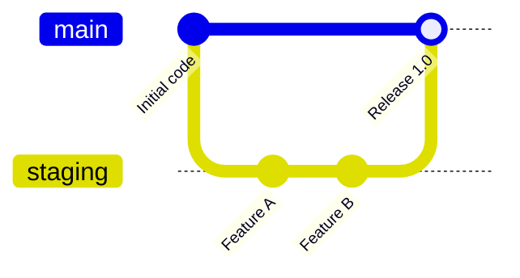

# Git Deployment Workflow

To maintain stability and prevent experimental chatbot features from breaking the customer-facing production storefront widget, we operate a two-tier git deployment workflow.

---

## 1. Git Branching Model



*   **`main` (Production)**:
    *   This is the stable release branch.
    *   Only fully tested, approved, and QA-verified features may be merged here.
    *   Never commit directly to `main` during daily development.
*   **`staging` (Test Environment)**:
    *   This is the daily integration branch.
    *   All new feature branches, hotfixes, and experimental chatbot changes are merged here first.
    *   Continuous integration builds automatically deploy the staging branch to the Railway Staging Console environment.

---

## 2. Railway Services Structure

We run two parallel services on Railway:

| Service Name | Branch | URL Prefix | Database | Target Use |
| :--- | :--- | :--- | :--- | :--- |
| **commerce-support-console** | `main` | `...-production.up.railway.app` | Production Supabase | Production Storefront & Live Dashboard |
| **commerce-support-staging** | `staging` | `...-staging.up.railway.app` | Staging Supabase | Staging Triage & QA Sandbox testing |

---

## 3. Pre-Release QA Checklist

Before merging the `staging` branch into `main` for production release, developers must perform the following:

1.  **Run Integration Test Suite**:
    ```bash
    cd backend
    ./venv/bin/python test_takeover_flow.py
    ```
    Confirm all test scenarios (takeovers, auto-escalations, delete cascades, fallback replies) return a green status.
2.  **Verify Dashboard Labeling**:
    *   Verify the admin dashboard is showing the yellow `STAGING` environment tag on staging, and green `PRODUCTION` tag on production.
3.  **Confirm Search Index Blocking**:
    *   Verify that search engine crawlers are barred from indexing the staging console. Responses must return `X-Robots-Tag: noindex, nofollow` headers and meta tag blocks.
4.  **Shopify Storefront Duplicate Testing**:
    *   Open the Shopify Storefront duplicate test theme.
    *   Send test queries and confirm that requests are successfully routed to the staging Railway service and replies are resolved.
